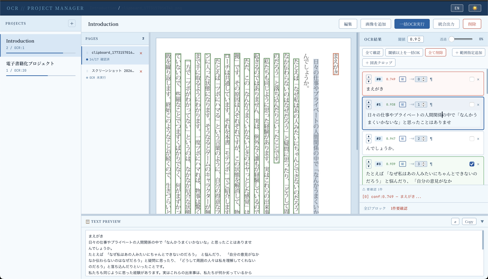
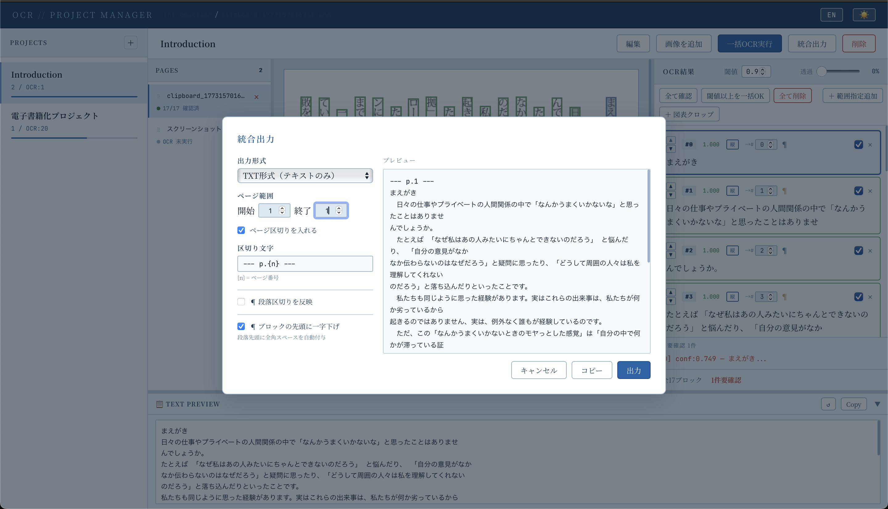

# OCR Project Manager

*日本語は下にあります / Japanese follows below.*

A workflow manager for [NDLOCR-Lite](https://github.com/ndl-lab/ndlocr-lite) — the OCR engine developed by the National Diet Library of Japan.

Upload scanned pages, run OCR, review and correct results block by block, and export clean text — all in your browser, all offline.

**UI supports Japanese and English** (toggle in the top-right corner).

---





*Sample document: 「モテツボ 真面目系男子の恋愛解体新書」（キマイラ著、セルバ出版、2024）*

---

## Features

### Project Management
- Auto-generates folder structure per project
- Edit project name, description, and writing direction (vertical / horizontal / mixed)
- Delete projects

### Image Management
- Drag and drop image upload (PNG / JPG, multiple files)
- PDF upload with automatic page-by-page conversion
- Paste images directly from clipboard
- Auto-sort by filename on upload
- Drag-and-drop page reordering
- Delete individual pages

### OCR Execution
- Single-page OCR
- Batch OCR (unprocessed pages only)
- Per-block re-OCR with engine selection (Lite / Lite+)

### Verification and Editing
- Confidence score display with adjustable threshold
- Visual overlay: orange = review required, green = confirmed
- Adjustable overlay opacity
- Block-level inline text editing
- Confirmed flag per block
- Paragraph break marker per block
- Drag-and-drop block reordering
- Direct position input for quick block repositioning
- Draw a region on the image to manually add a text block
- Image crop — save any region as a standalone file
- Delete individual blocks
- Bulk actions: Check All / Check Above Threshold / Delete All

### Correction Dictionary
- Per-project correction rules (find and replace)
- Apply corrections to all pages in one click
- Suggestion analysis — detects recurring edit patterns and proposes new rules

### Text Preview Panel
- Displays combined text for the current page
- One-click clipboard copy
- Reload button after block edits

### Export
- Page range selection
- Page separator with {n} for page number
- Paragraph break reflection
- TXT and JSON formats
- Preview before export with Copy button

---

## Requirements

| Requirement | Notes |
|---|---|
| Python 3.8+ | |
| NDLOCR-Lite | Install separately at ~/ndlocr-lite/ |
| Flask / Pillow / pdf2image | Auto-installed by launcher |
| poppler | Mac: brew install poppler / Linux: apt install poppler-utils |

---

## Installation

### 1. Install NDLOCR-Lite

git clone https://github.com/ndl-lab/ndlocr-lite ~/ndlocr-lite
cd ~/ndlocr-lite/ndlocr-lite-gui
pip3 install -r ../requirements.txt

### 2. Install OCR Project Manager
git clone https://github.com/StateToolsLab/ocr-project-manager.git ~/ocr-project-manager

### 3. Set execute permission (Mac)
chmod +x ~/ocr-project-manager/OCR_Project_Manager.command

### 4. Create desktop shortcut (Mac)
ln -s ~/ocr-project-manager/OCR_Project_Manager.command ~/Desktop/OCR_Project_Manager.command

---

## Usage

Double-click OCR_Project_Manager.command on the desktop.

The launcher checks your environment automatically:
- All dependencies found: opens http://localhost:5050 directly
- Any missing: shows a setup UI with install instructions

On first launch, macOS may show a security warning. Use right-click -> Open to bypass it.

---

## Data Storage

```
~/OCR_Projects/
└── project-name/
    ├── input/                   # Source images
    ├── output/
    │   ├── *.json               # OCR results
    │   ├── *_overlay.json       # Edit data
    │   ├── crop/                # Cropped images
    │   └── correction_dict.json # Correction dictionary
    └── meta.json                # Project settings
```

---

## Changelog

### v3 (2026-04)
- Correction dictionary (per-project rules, apply, suggestion analysis)
- Per-block re-OCR with Lite / Lite+ engine selection
- Writing direction setting per project
- Clipboard paste for image upload
- File upload modal with drag-and-drop zone
- Pencil icon edit button next to project name
- Bug fix: spurious folders no longer appear in project list

### v2 (2026-03)
- PDF import with automatic page conversion
- Image crop to file
- Smart launcher with dependency check

### v1
- Initial release

---

## Credits

This tool uses [NDLOCR-Lite](https://github.com/ndl-lab/ndlocr-lite) by the National Diet Library of Japan.
License: CC BY 4.0 (https://creativecommons.org/licenses/by/4.0/)
---
---

# OCR Project Manager（日本語）

[NDLOCR-Lite](https://github.com/ndl-lab/ndlocr-lite)（国立国会図書館）を使ったOCR作業を、ローカルブラウザ上で一元管理できるツールです。

画像のアップロード、OCR実行、結果の検証・編集、テキストの統合出力までを一つのUIで完結できます。インターネット接続不要、すべてローカルで動作します。

**UIは日本語・英語に対応しています（画面右上で切り替え）。**

---

## 主な機能

### プロジェクト管理
- プロジェクト単位でフォルダを自動生成・管理
- プロジェクト名・説明・筆記方向（縦書き／横書き／混在）の編集
- プロジェクト単位での削除

### 画像管理
- 画像のドラッグ＆ドロップアップロード（PNG / JPG、複数可）
- PDFアップロード → ページごとに画像へ自動変換
- クリップボードからの画像貼り付け
- アップロード時にファイル名順で自動ソート
- ページリストでのドラッグによる並び替え
- ページ単位での削除

### OCR実行
- 1ページずつのOCR実行
- 一括OCR実行（未処理ページのみ対象）
- ブロック単位の再OCR（Lite / Lite+ エンジン選択可）

### 結果の検証・編集
- 信頼度スコア表示・閾値設定
- 画像上にオーバーレイ表示（オレンジ=要確認、緑=確認済み）
- 透過度スライダー
- ブロック単位のインライン編集
- 確認済みフラグ
- 段落区切りマーカー（¶）をブロック単位に設定
- ブロックのドラッグによる並び替え
- 移動先番号を直接入力して移動
- 画像上をドラッグして範囲指定 → テキスト手動入力でブロックを追加
- 画像クロップ保存
- ブロック単位の削除
- 一括確認済み / 閾値以上を一括OK / 全て削除

### 校正辞書
- プロジェクト単位の補正ルール（置換前 → 置換後）
- 全ページへのワンクリック適用
- 候補提案 — 編集パターンを自動分析してルール候補を提示

### テキストプレビュー
- 現在ページの全テキストを結合表示
- ワンクリックでクリップボードにコピー
- 再読込みボタン

### 統合出力
- ページ範囲指定
- ページ区切り文字（{n}でページ番号埋め込み）
- 段落区切りの反映
- TXT形式 / JSON形式（座標・信頼度付き）
- 出力前プレビュー＋コピーボタン

---

## 動作環境

| 必要なもの | 備考 |
|---|---|
| Python 3.8以上 | |
| NDLOCR-Lite | ~/ndlocr-lite/ に別途インストール |
| Flask / Pillow / pdf2image | ランチャーが自動インストール |
| poppler | Mac: brew install poppler / Linux: apt install poppler-utils |

---

## インストール手順

### 1. NDLOCR-Liteをインストール

git clone https://github.com/ndl-lab/ndlocr-lite ~/ndlocr-lite
cd ~/ndlocr-lite/ndlocr-lite-gui
pip3 install -r ../requirements.txt

### 2. OCR Project Managerをインストール
git clone https://github.com/StateToolsLab/ocr-project-manager.git ~/ocr-project-manager

### 3. 起動スクリプトに実行権限を付与（Mac）
chmod +x ~/ocr-project-manager/OCR_Project_Manager.command

### 4. デスクトップにショートカットを作成（Mac）
ln -s ~/ocr-project-manager/OCR_Project_Manager.command ~/Desktop/OCR_Project_Manager.command

---

## 起動方法

デスクトップの OCR_Project_Manager.command をダブルクリック。

起動時に依存ライブラリを自動チェックします：
- 全て揃っている場合 → http://localhost:5050 で直接起動
- 不足がある場合 → セットアップ画面でインストール案内

初回起動時はMacのセキュリティ警告が出ます。右クリック→「開く」で起動してください。

---

## プロジェクトデータの保存場所

```
~/OCR_Projects/
└── プロジェクト名/
    ├── input/                   # 元画像
    ├── output/
    │   ├── *.json               # OCR結果
    │   ├── *_overlay.json       # 編集データ
    │   ├── crop/                # クロップ画像
    │   └── correction_dict.json # 校正辞書
    └── meta.json                # プロジェクト設定
```

---

## 更新履歴

### v3（2026年4月）
- 校正辞書（プロジェクト単位のルール管理・一括適用・候補提案）
- ブロック単位の再OCR（Lite / Lite+ 選択可）
- 筆記方向設定（縦書き／横書き／混在）
- クリップボードからの画像貼り付け
- ファイル追加モーダル（ドラッグ＆ドロップゾーン）
- プロジェクト名横の鉛筆アイコン編集ボタン
- バグ修正：非プロジェクトフォルダがリストに表示される問題

### v2（2026年3月）
- PDFインポート（ページごとに自動変換）
- 画像クロップ保存機能
- スマートランチャー（依存チェック）

### v1
- 初回リリース

---

## クレジット

OCRエンジンとして NDLOCR-Lite（国立国会図書館）を使用しています。
ライセンス：CC BY 4.0 (https://creativecommons.org/licenses/by/4.0/)
